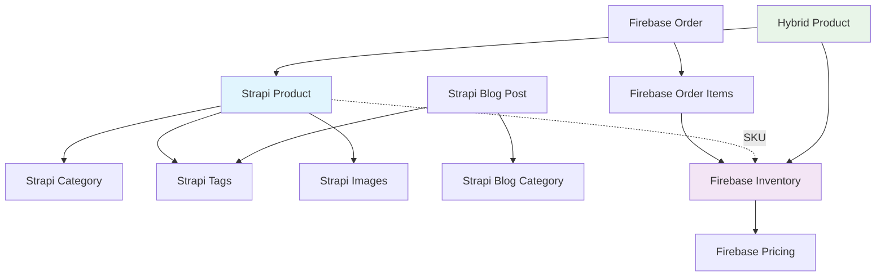

# 🏗️ Heritage Farms Hybrid Architecture Guide

## 📋 Table of Contents
1. [System Overview](#system-overview)
2. [Entity Relationships](#entity-relationships)
3. [Data Flow](#data-flow)
4. [Strapi Entities](#strapi-entities)
5. [Firebase Entities](#firebase-entities)
6. [Hybrid Operations](#hybrid-operations)
7. [API Integration](#api-integration)
8. [User Workflows](#user-workflows)

---

## 🎯 System Overview

### **Three-Tier Architecture:**

```
┌─────────────────┐    ┌─────────────────┐    ┌─────────────────┐
│   NEXT.JS       │    │     STRAPI      │    │    FIREBASE     │
│   Frontend      │    │   Content CMS   │    │   Commerce DB   │
│                 │    │                 │    │                 │
│ • User Interface│◄──►│ • Product Info  │    │ • Inventory     │
│ • Admin Panel   │    │ • Blog Posts    │    │ • Orders        │
│ • Shopping Cart │    │ • Media Library │    │ • Pricing       │
│ • Checkout      │    │ • Categories    │    │ • Users         │
└─────────────────┘    └─────────────────┘    └─────────────────┘
```

### **Why This Architecture?**
- **Strapi**: Content management (descriptions, images, blog)
- **Firebase**: Real-time commerce operations (inventory, orders, payments)
- **Next.js**: Unified frontend combining both data sources

---

## 🔗 Entity Relationships

### **Core Entity Map:**



---

## 🗂️ Strapi Entities

### **1. Product** *(Content & Marketing)*
```typescript
interface StrapiProduct {
  id: number;
  sku: string;                    // Unique identifier (links to Firebase)
  name: string;                   // Display name
  localName: string;              // Traditional name
  description: string;            // Rich marketing content
  cultivar?: string;              // Plant variety
  healthBenefits?: string;        // Nutritional information
  growingMethod?: string;         // How it's grown
  maturityTime?: string;          // Harvest time
  priceUnit: 'bunch' | 'lb' | 'kg' | 'piece';
  
  // Relationships
  category: StrapiCategory;       // One-to-Many
  tags: StrapiTag[];             // Many-to-Many
  images: StrapiImage[];         // One-to-Many
  
  // Content Management
  featured: boolean;
  seo: StrapiSEO;
  publishedAt: Date;
}
```

**Operations:**
- ✏️ **Content Team**: Updates descriptions, images, marketing copy
- 🔍 **Public**: Browse, search, filter products
- 📱 **Frontend**: Display product catalog

### **2. Category** *(Product Organization)*
```typescript
interface StrapiCategory {
  id: number;
  name: string;                   // "Leafy Greens", "Herbs"
  slug: string;                   // URL-friendly name
  description?: string;           // Category description
  image?: StrapiImage;           // Category banner
  
  // Relationships
  products: StrapiProduct[];     // One-to-Many
}
```

**Operations:**
- 📝 **Content Team**: Organize product catalog
- 🏷️ **Frontend**: Filter products by category
- 🗂️ **Navigation**: Category-based browsing

### **3. Tag** *(Cross-cutting Labels)*
```typescript
interface StrapiTag {
  id: number;
  name: string;                   // "West African", "Organic"
  slug: string;
  description?: string;
  
  // Relationships
  products: StrapiProduct[];     // Many-to-Many
  blogPosts: StrapiBlogPost[];   // Many-to-Many
}
```

**Operations:**
- 🏷️ **Content Team**: Tag products and content
- 🔍 **Users**: Search by cultural origin, growing method
- 📊 **Analytics**: Track popular themes

### **4. Blog Post** *(Content Marketing)*
```typescript
interface StrapiBlogPost {
  id: number;
  title: string;
  slug: string;
  excerpt?: string;
  content: string;                // Rich text content
  featuredImage?: StrapiImage;
  readTime?: number;
  
  // Relationships
  author: StrapiUser;
  categories: StrapiBlogCategory[];
  tags: StrapiTag[];
  
  // SEO
  seo: StrapiSEO;
  publishedAt: Date;
}
```

---

## 🔥 Firebase Entities

### **1. Inventory** *(Real-time Stock)*
```typescript
interface FirebaseInventory {
  sku: string;                    // Links to Strapi Product
  stockQuantity: number;          // Current stock level
  price: number;                  // Current price in dollars
  active: boolean;                // Available for purchase
  inStock: boolean;               // Computed: stockQuantity > 0
  
  // Operational Data
  costPrice: number;              // Internal cost
  supplier?: string;              // Source information
  harvestDate?: Date;             // When harvested
  expiryDate?: Date;              // Sell-by date
  
  // Metadata
  createdAt: Date;
  updatedAt: Date;
}
```

**Operations:**
- 📦 **Operations Team**: Update stock levels, pricing
- 🔄 **Automatic**: Real-time stock deduction on orders
- 📊 **Reports**: Inventory levels, turnover

### **2. Order** *(Transaction Records)*
```typescript
interface FirebaseOrder {
  id: string;
  customerId?: string;            // Links to User (optional for guests)
  
  // Order Details
  items: OrderItem[];
  totalAmount: number;
  status: 'pending' | 'confirmed' | 'processing' | 'shipped' | 'delivered' | 'cancelled';
  
  // Customer Info
  customerInfo: {
    name: string;
    email: string;
    phone: string;
  };
  
  // Shipping
  shippingAddress: Address;
  shippingMethod: 'pickup' | 'delivery';
  shippingCost: number;
  
  // Payment
  paymentMethod: 'cash' | 'card' | 'transfer';
  paymentStatus: 'pending' | 'paid' | 'failed';
  
  // Timestamps
  createdAt: Date;
  updatedAt: Date;
  deliveryDate?: Date;
}

interface OrderItem {
  sku: string;                    // Links to Product
  quantity: number;
  unitPrice: number;              // Price at time of order
  subtotal: number;               // quantity * unitPrice
}
```

**Operations:**
- 🛒 **Customers**: Place orders, track status
- 📋 **Operations**: Process orders, update status
- 💰 **Finance**: Track payments, revenue

### **3. User** *(Customer Management)*
```typescript
interface FirebaseUser {
  uid: string;
  email: string;
  displayName?: string;
  
  // Customer Details
  profile: {
    firstName: string;
    lastName: string;
    phone?: string;
    preferences: string[];         // Dietary, cultural preferences
  };
  
  // Addresses
  addresses: Address[];
  defaultAddressId?: string;
  
  // Order History
  orders: string[];               // Order IDs
  
  // Preferences
  newsletter: boolean;
  notifications: boolean;
  
  // Metadata
  createdAt: Date;
  lastLoginAt: Date;
}
```

---

## 🔄 Data Flow

### **Product Display Flow:**
```
1. User visits product page
   ↓
2. Next.js fetches from BOTH:
   • Strapi: Product content (name, description, images)
   • Firebase: Real-time inventory (price, stock)
   ↓
3. Merge data into EnrichedProduct
   ↓
4. Display unified product information
```

### **Order Placement Flow:**
```
1. User adds items to cart (Strapi product info)
   ↓
2. Checkout process begins
   ↓
3. Validate inventory in Firebase
   ↓
4. Create order in Firebase
   ↓
5. Deduct stock quantities
   ↓
6. Send confirmation email
   ↓
7. Admin receives order notification
```

### **Content Update Flow:**
```
Marketing Team updates Strapi:
1. Edit product descriptions
2. Upload new images
3. Publish blog posts
4. Organize categories
   ↓
Frontend automatically reflects changes

Operations Team updates Firebase:
1. Adjust pricing
2. Update stock levels
3. Process orders
4. Manage inventory
   ↓
Real-time updates on website
```

---

## 🔧 Hybrid Operations

### **1. Product Catalog Management**
```typescript
// Hybrid Product Service
class ProductService {
  // Get enriched product (Strapi + Firebase)
  async getEnrichedProduct(sku: string): Promise<EnrichedProduct> {
    const [content, inventory] = await Promise.all([
      strapiService.getProduct(sku),     // Content from Strapi
      firebaseService.getInventory(sku)  // Pricing/stock from Firebase
    ]);
    
    return {
      ...content,      // Description, images, categories
      ...inventory,    // Price, stock, availability
      inStock: inventory.stockQuantity > 0 && inventory.active
    };
  }
}
```

### **2. Order Processing**
```typescript
// Hybrid Order Flow
class OrderService {
  async processOrder(orderData: OrderRequest): Promise<Order> {
    // 1. Validate products exist in Strapi
    await this.validateProducts(orderData.items);
    
    // 2. Check inventory availability in Firebase
    await this.validateInventory(orderData.items);
    
    // 3. Create order in Firebase
    const order = await firebaseService.createOrder(orderData);
    
    // 4. Deduct inventory
    await this.updateInventory(orderData.items);
    
    // 5. Send notifications
    await this.sendNotifications(order);
    
    return order;
  }
}
```

### **3. Admin Dashboard Operations**
```typescript
// Different teams access different systems
class AdminService {
  // Content team uses Strapi admin
  async updateProductContent(sku: string, content: ContentUpdate) {
    return strapiService.updateProduct(sku, content);
  }
  
  // Operations team uses Firebase admin
  async updateInventory(sku: string, inventory: InventoryUpdate) {
    return firebaseService.updateInventory(sku, inventory);
  }
  
  // Combined view for managers
  async getProductOverview(sku: string) {
    const [content, inventory, orders] = await Promise.all([
      strapiService.getProduct(sku),
      firebaseService.getInventory(sku),
      firebaseService.getOrdersByProduct(sku)
    ]);
    
    return { content, inventory, orders };
  }
}
```

---

## 🚀 User Workflows

### **Customer Journey:**
1. **Browse** → Strapi provides content, Firebase shows availability
2. **Search** → Strapi handles text search, Firebase filters by availability
3. **Add to Cart** → Combine product info from both systems
4. **Checkout** → Firebase handles transaction, inventory updates
5. **Track Order** → Firebase provides real-time status updates

### **Content Team Workflow:**
1. **Log into Strapi admin** → `http://localhost:1337/admin`
2. **Update product descriptions** → Rich text editor
3. **Upload new images** → Media library
4. **Publish blog posts** → Content management
5. **Organize categories** → Taxonomy management

### **Operations Team Workflow:**
1. **Log into custom admin** → Your existing Firebase admin
2. **Update inventory levels** → Real-time stock management
3. **Process orders** → Order fulfillment workflow
4. **Adjust pricing** → Dynamic pricing updates
5. **Generate reports** → Analytics and insights

---

## 🔌 API Integration Points

### **Frontend API Calls:**
```typescript
// Product catalog
GET /api/products → Hybrid service (Strapi + Firebase)
GET /api/categories → Strapi only
GET /api/products/search → Strapi content + Firebase availability

// Commerce operations
POST /api/orders → Firebase only
GET /api/orders/:id → Firebase only
PUT /api/inventory/:sku → Firebase only (admin)

// Content management
GET /api/blog → Strapi only
GET /api/pages → Strapi only
```

### **Admin API Calls:**
```typescript
// Content management (Strapi)
PUT /api/strapi/products/:id → Content updates
POST /api/strapi/media → Image uploads
GET /api/strapi/analytics → Content performance

// Operations management (Firebase)
PUT /api/admin/inventory/:sku → Stock updates
GET /api/admin/orders → Order management
POST /api/admin/reports → Business analytics
```

---

## 🎯 Summary

### **Clear Separation of Concerns:**
- **Strapi** = Content, Marketing, SEO, Media
- **Firebase** = Commerce, Inventory, Orders, Payments
- **Next.js** = Unified User Experience

### **Team Responsibilities:**
- **Marketing/Content Team** → Strapi admin
- **Operations Team** → Firebase admin (your existing system)
- **Developers** → Next.js frontend combining both

### **Data Relationships:**
- **SKU** is the bridge between systems
- **Strapi Products** ←→ **Firebase Inventory** (via SKU)
- **Orders** reference Products by SKU
- **Everything else** stays in its respective system

This hybrid approach gives you the best of both worlds: powerful content management with robust e-commerce operations! 🌱
